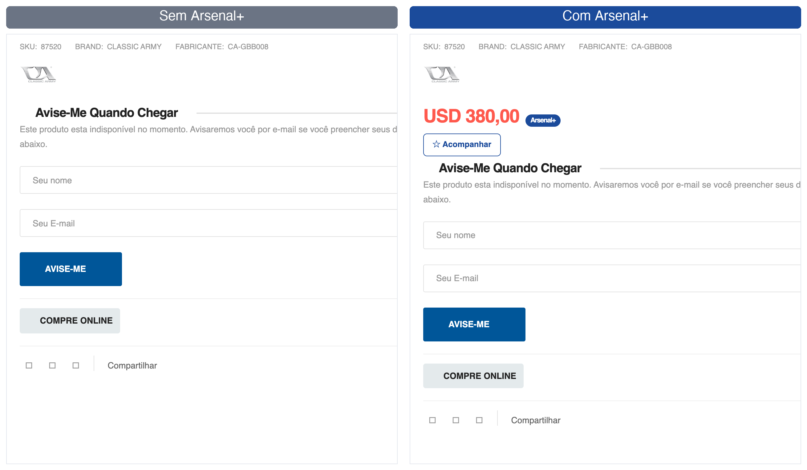
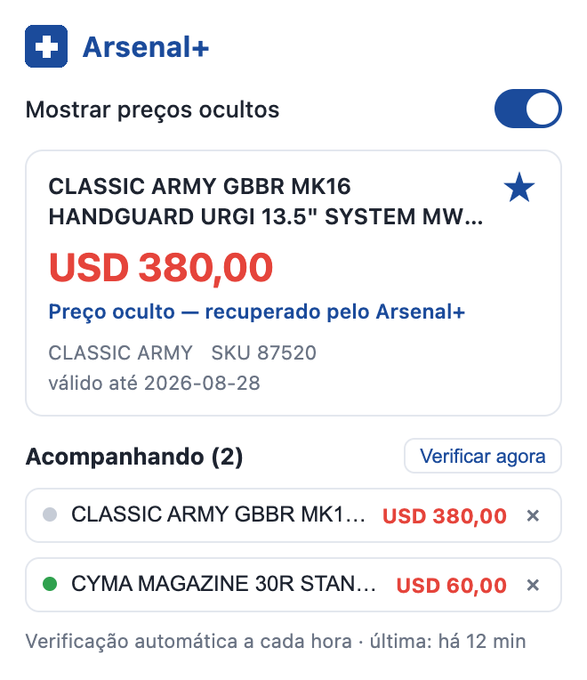

# Arsenal+


Extensão de Chrome com melhorias para [arsenalsports.com](https://www.arsenalsports.com/).

> **Projeto não oficial**, sem afiliação com a Arsenal Sports.

## Funcionalidades

- **Preço oculto**: quando um produto está indisponível, a loja esconde o preço e mostra
  só o formulário "Avise-me quando chegar" — mas o preço continua presente nos metadados
  da página (`<meta property="product:price:amount">`). A extensão lê esses metadados e
  exibe o preço no lugar onde ele apareceria normalmente, com um selo **Arsenal+**
  indicando que foi a extensão que o recuperou.
- **Preços nas listagens**: em resultados de busca e categorias, os cartões de produtos
  indisponíveis (que não mostram preço) são preenchidos buscando o preço da página de
  cada produto, com cache de 24h e um intervalo entre requisições para não sobrecarregar
  a loja.
- **Filtros de catálogo (presets)**: a busca da loja é um E de trechos do nome e seus
  filtros de atributo não são mantidos, então não dá para navegar por "todas as
  coronhas" ou "todos os rifles GBB" nativamente. Em qualquer listagem, uma barra de
  presets (Rifles GBB, Magazines, Bolts, Nozzles, Hop-up, Canos, Gatilhos, Coronhas,
  Handguards, Grips frontais, Pistol grips, Slides) roda as buscas que cobrem o tipo,
  junta todas as páginas de resultado, filtra pelo nome e mostra tudo em uma página só
  (usando os próprios cartões da loja, então preços e filtros continuam funcionando).
- **Novidades**: a loja não tem ordenação por data de cadastro; o preset "Novidades" lê
  o sitemap (todo o catálogo em uma requisição), ordena pelo ID do produto (sequencial,
  então maior = mais recente), busca as páginas dos produtos mais novos e mostra os de
  departamentos de airsoft, mais novos primeiro — com um selo **NOVO** nos que entraram
  na loja desde a sua última visita.
- **Filtro de preço**: a loja tem um filtro de faixa de preço quebrado no servidor; a
  extensão adiciona campos mín/máx na barra de ordenação que filtram os produtos da
  página no navegador (persistem entre páginas da mesma busca).
- **Filtros rápidos de tipo**: junto do filtro de preço, as caixas "Só réplicas"
  (esconde peças, magazines e acessórios) e "Sem pistolas" (esconde pistolas e
  revólveres) filtram qualquer listagem pelo nome do produto — útil porque o filtro
  de propulsão da própria loja não tem nenhum produto marcado.
- **Lista de acompanhamento**: um botão ☆ nas páginas de produto (e no popup) adiciona
  o item a uma lista verificada automaticamente a cada hora em segundo plano. Quando um
  produto volta ao estoque, você recebe uma notificação do navegador com o preço.
- **Popup (React)**: clicando no ícone da extensão abre um painel com um toggle para
  ligar/desligar a exibição de preços ocultos (aplicado na hora, sem recarregar a página),
  um cartão com o produto da aba atual (nome, preço, marca, SKU e de onde o preço veio) e
  a lista de acompanhamento com status de disponibilidade e "Verificar agora".

## Screenshots

Produto indisponível: a loja esconde o preço e mostra só o formulário "Avise-me" —
o Arsenal+ recupera o preço e adiciona o botão **☆ Acompanhar**:



O popup mostra o produto da aba atual e a lista de acompanhamento, com status de
disponibilidade e verificação manual:



## Instalação

1. Baixe o `arsenalplus-x.y.z.zip` mais recente na página de
   [Releases](../../releases).
2. Extraia o zip em uma pasta (que precisa permanecer no disco após a instalação).
3. Abra `chrome://extensions` no Chrome.
4. Ative o **Modo do desenvolvedor** (canto superior direito).
5. Clique em **Carregar sem compactação** ("Load unpacked") e selecione a pasta extraída.
6. Visite qualquer página de produto em arsenalsports.com.

> Instalada dessa forma, a extensão **não atualiza sozinha**: para atualizar, baixe o
> zip da nova versão, extraia por cima da mesma pasta e clique em ↻ na extensão em
> `chrome://extensions`. O Chrome também pode exibir de tempos em tempos um aviso
> sobre extensões em modo de desenvolvedor — é esperado.

## Desenvolvimento

```bash
npm install
npm run build     # gera dist/
npm run dev       # build em modo watch
```

O popup usa React + Tailwind CSS v4 + [shadcn/ui](https://ui.shadcn.com) (tema
_blue_, config em `components.json`; componentes em `src/components/ui/`). Os
content scripts são JS puro — os botões injetados no site imitam o mesmo tema em
CSS simples (`public/styles.css`).

## Instalação (modo desenvolvedor)

1. Rode `npm run build`.
2. Abra `chrome://extensions` no Chrome.
3. Ative o **Modo do desenvolvedor** (canto superior direito).
4. Clique em **Carregar sem compactação** ("Load unpacked") e selecione a pasta **`dist/`**.
5. Visite qualquer página de produto em arsenalsports.com.

Depois de alterar arquivos, rode o build de novo (ou deixe `npm run dev` rodando) e
clique em ↻ na extensão em `chrome://extensions`.

## Estrutura

```
├── public/                 # copiado como está para dist/
│   ├── manifest.json
│   ├── common.js           # helpers compartilhados (preço/meta, classificação por nome)
│   ├── content-product.js  # páginas de produto: preço oculto + botão acompanhar
│   ├── content-listing.js  # listagens: preços nos cartões + filtros de preço e tipo
│   ├── content-presets.js  # presets: buscas combinadas por tipo de produto/peça
│   ├── background.js       # service worker: verificação periódica da lista
│   ├── styles.css          # estilos injetados no site
│   └── icons/
├── popup.html              # entrada do popup (Vite)
├── src/
│   ├── popup/              # UI do popup em React
│   │   ├── main.jsx
│   │   ├── App.jsx
│   │   └── popup.css       # Tailwind v4 + tema shadcn (blue) + estilos do popup
│   ├── components/ui/      # componentes shadcn/ui (button.jsx)
│   └── lib/utils.js        # cn()
├── components.json         # config do shadcn/ui
└── vite.config.js
```
